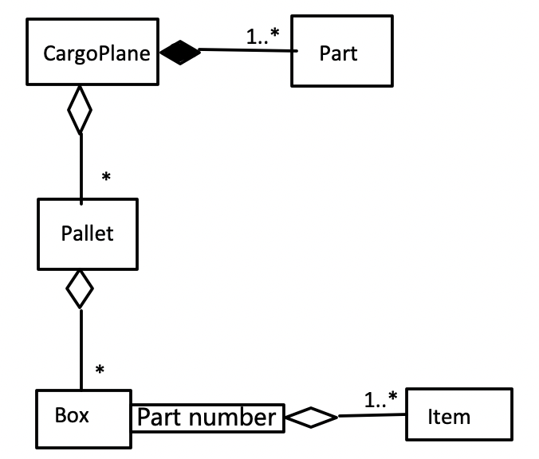
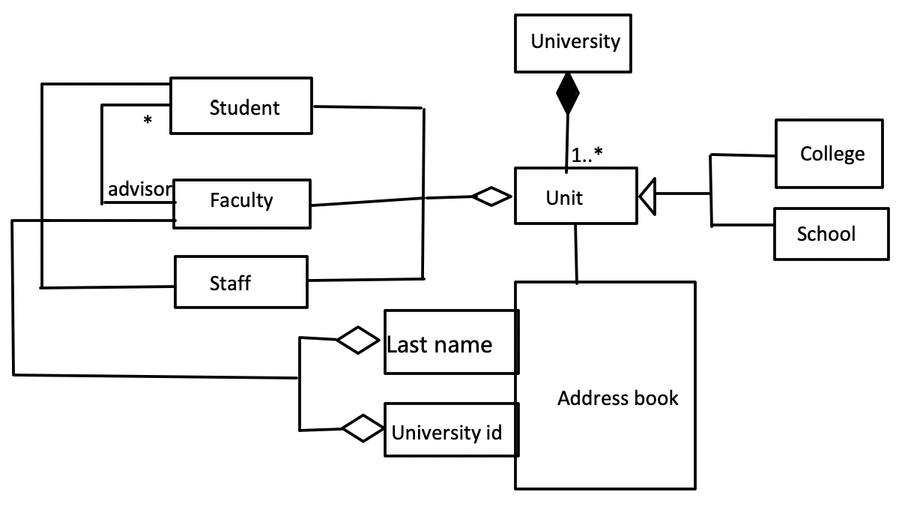

# Homework 2

## Names of Team Members

(Sorted by last name)

- Yushuo Ruan
- Tianshu Pang
- Peng Yan
- Ziying Zhang

## 1. 

## 2. 

## 3.

## 4.

D cannot access B, because B does not implement interface, and D can only access other classes through interface C in this diagram. 

## 5.

Violate the "design by contract" design heuristic. This will break previous abstract and robust code. This will also seriously degrade the maintainability of the code. Subclass should maintain the behavior of the superclass. 

In this particular case, the total area of all shapes will probably no longer be twice as large as the total perimeters. The behaviour in different subclasses are different, so it is difficult to maintain code in these classes. Besides, the super class **Shape** will not be a proper abstraction of all these subclasses because they don't maintain the same behaviour in superclass **Shape**.

In addition, for some special cases, like the system only allow producing a circle, a square, an equilateral triangle with a specific side or radius, which has a certain relation between perimeters and area, using this new method may get right result although it is not reasonable.
## 6.

